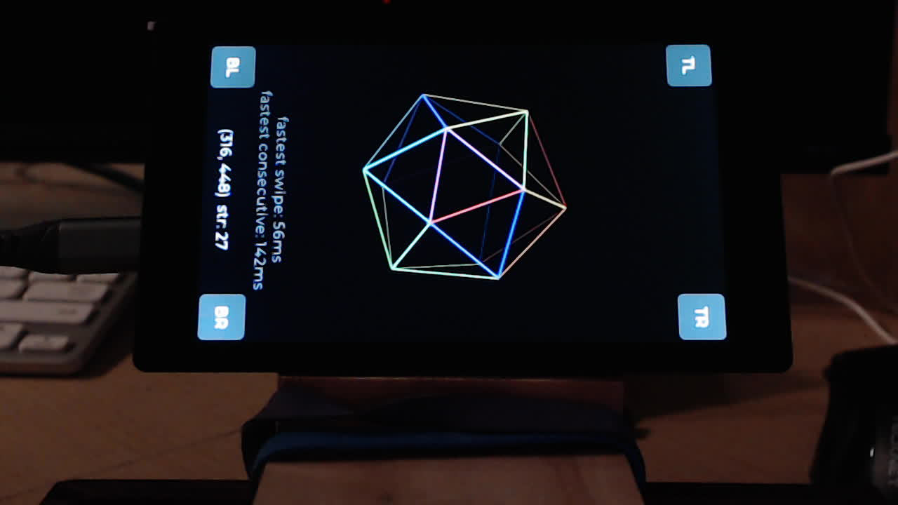

# Touch Test



Minimal touch verification app for board bringup.

## Purpose

Validate the full `board_init()` build path including touch registration through `esp_lvgl_adapter` — without camera pipeline dependencies. The QR decoder app validated display rendering on the LVGL adapter but skipped touch input; this app closes that gap.

## Features

A wireframe icosahedron with per-edge hue coloring and z-depth shading serves as the primary visual feedback element:

- **Drag**: slow deliberate finger movement rolls the icosahedron in viewport space
- **Swipe**: flick gesture applies spin with inertia (speed proportional to swipe velocity), decays to a stop; diagonal swipes spin on the corresponding axis
- **Tap**: color flash on contact, scale burst on release (suppressed if a swipe or drag occurred)
- **Pinch zoom**: two-finger pinch scales the icosahedron up/down

Small corner buttons (TL/TR/BL/BR) verify touch coordinate mapping — if mirrored or swapped, the wrong button lights up.

Swipe timing metrics track fastest single swipe and fastest consecutive swipe detection.

Raw touch coordinates and driver strength value (GT911 only) displayed at bottom. All events logged to serial console.

## Build

```bash
# Default board (P4 LCD 4.3)
make docker-build

# Specific board
make docker-build BOARD=waveshare_p4_lcd35

# Clean build (required when switching boards)
make clean && make docker-build BOARD=...
```

## Flash

```bash
make dist BOARD=waveshare_p4_lcd43
cd dist/waveshare_p4_lcd43
esptool.py --chip auto -b 460800 write_flash @flash_args
```
