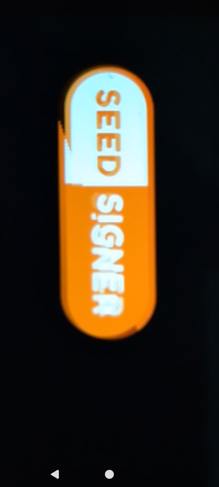

# SPI vs QSPI Display Interfaces

## Overview

The Waveshare ESP32 Touch LCD 3.5" boards come in two display variants that use fundamentally different SPI interfaces. This has significant implications for rendering performance, tearing, and the flush strategy used by the LVGL port.

| | Single SPI (ST7796) | QSPI (AXS15231B) |
|---|---|---|
| **Boards** | ESP32-S3 Touch LCD 3.5, ESP32-P4 WiFi6 Touch LCD 3.5 | ESP32-S3 Touch LCD 3.5**B** |
| **Data lines** | 1 (MOSI only) | 4 (DATA0-DATA3) |
| **Clock speed** | 80 MHz | 40 MHz |
| **Effective data rate** | 10 MB/s | 20 MB/s |
| **Full frame transfer** | 307 KB / 10 MB/s = **~31 ms** | 307 KB / 20 MB/s = **~15 ms** |
| **Panel refresh** | 60 Hz = 16.7 ms | 60 Hz = 16.7 ms |
| **Fits in one refresh?** | No (31 ms > 16.7 ms) | Yes (15 ms < 16.7 ms) |
| **Tearing** | Visible on fast animations | Not visible |

## Tearing on Single SPI Displays

When the SPI data transfer for a frame update takes longer than the panel's refresh cycle, the LCD panel reads from its internal GRAM (to drive the physical pixels) while new data is simultaneously being written. The boundary between old and new frame data appears as a diagonal tear line.

*The SeedSigner logo during screensaver animation on the ESP32-S3 Touch LCD 3.5 (ST7796, single SPI). The diagonal tear line shows where the panel's scan has outpaced the SPI data transfer.*

### Why the tear is diagonal

The LCD panel scans from top to bottom in rows, refreshing ~19 rows per millisecond at 60 Hz. Meanwhile, the SPI interface writes new pixel data from top to bottom at a different rate (~16 rows per millisecond at 80 MHz single SPI). Because these rates differ, the boundary between old and new data drifts diagonally across the screen.

### Why QSPI doesn't tear

With 4 data lines at 40 MHz, QSPI transfers the full frame in ~15 ms — just under the 16.7 ms panel refresh cycle. The entire frame is written before the panel completes one scan, so no tear boundary is visible.

## Rendering Strategies

### QSPI boards (AXS15231B — 3.5B)

Uses `direct_mode` with a full-frame SPIRAM buffer and a custom banded flush callback:

1. LVGL renders at absolute screen coordinates into a 307 KB SPIRAM framebuffer
2. The flush callback divides the frame into 80-line bands (51 KB each — within SPI DMA limits)
3. Each band is copied from SPIRAM to an internal SRAM DMA bounce buffer with 90° rotation + byte swap
4. DMA sends each band to the panel while the next band is being prepared (double-buffered pipeline)
5. All 6 bands are sent before `lv_display_flush_ready()` is called

The 90° rotation in the flush callback is required because the AXS15231B has a hardware defect where CASET/RASET commands don't work over QSPI (the "RASET bug"). The panel always draws from (0,0), so software rotation is the only option.

### Single SPI boards (ST7796 — 3.5, P4)

Uses half-screen double-buffered partial updates with hardware MADCTL rotation:

1. Two half-screen SPIRAM buffers (each ~76 KB for 480×160 pixels)
2. LVGL renders dirty regions into one buffer while the other is DMA'd to the panel
3. Hardware rotation via MADCTL register (swap_xy + mirror — no per-pixel software rotation needed)
4. `swap_bytes` flag in esp_lvgl_port handles RGB565 byte order in the flush callback
5. Only dirty regions are sent to the panel (bandwidth efficient for small UI updates)

This approach is optimal for the single SPI bandwidth constraint. Alternative approaches were evaluated:

| Approach | Result |
|---|---|
| **40-line buffer (original)** | Too many small SPI transactions, choppy rendering |
| **Half-screen double-buffer** | Good balance — current approach |
| **Full-frame direct_mode** | SPI DMA transaction size limit exceeded (307 KB > DMA max) |
| **Full-frame with custom banded flush** | Same tearing as half-screen — no improvement, more code |
| **full_refresh mode** | Wastes bandwidth on small updates, same tearing on large ones |

## Hardware Constraints

### SPI DMA Transaction Limit

The ESP32-S3 SPI DMA cannot reliably send a full 307 KB frame as a single transaction. The `esp_lcd_panel_io_spi` layer fails with `spi transmit (queue) color failed` for transfers exceeding the DMA descriptor chain limit. This is why QSPI boards use a banded flush (splitting into 51 KB bands) and why single SPI boards cannot use `direct_mode` with the default esp_lvgl_port flush callback.

### ST7796 SPI Clock Rating

The ST7796 datasheet specifies a maximum SPI write clock of ~15 MHz (66 ns cycle time). The Waveshare boards run at 80 MHz — well above the rated speed. The panel tolerates this overclocking, but it contributes to the tight timing margins that make tearing visible.

### Tearing Effect (TE) Pin

Some LCD panels expose a TE output pin that signals vertical blanking, allowing the host to synchronize data writes with the panel's scan. The Waveshare boards do not expose a TE pin, so scan-synchronized writes are not possible.

## Practical Impact

- **Menu navigation, button lists, text updates**: No visible tearing on either interface. The dirty region is small enough to transfer within one panel refresh cycle.
- **Screensaver animation**: Tearing visible on single SPI boards. The logo's dirty area (~83 lines) transfers in ~8 ms, but this spans multiple panel scan lines, creating a visible tear boundary.
- **Full-screen transitions**: Tearing visible on single SPI boards. Acceptable for most use cases since transitions are brief.

The tearing on single SPI boards is an inherent hardware limitation of the display interface, not a software issue. It cannot be eliminated without QSPI, a TE sync pin, or a lower-resolution display.
